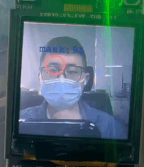

# 训练和部署一个FOMO模型

## 概述

本教程将指导您如何使用EdgeLab进行FOMO模型的训练和部署。

## 准备工作

### 硬件
- 一台Linux或者Mac电脑
- 一块ESP32-S3开发板
- 一根USB线


### 软件
- [EdgeLab](https://edgelab.readthedocs.io/zh_CN/latest/)
- [ESP-IDF](./get_start.md#环境安装)
- [edgelab-example-esp32](https://github.com/Seeed-Studio/edgelab-example-esp32)

```{note}
请根据对应软件的文档进行安装。
```

## 训练模型
### 准备数据集
你可以使用你熟悉的数据集获取方式， 以Roboflow提供的[mask-detection](https://universe.roboflow.com/compvis-final-project/mask-detection-m3skq)为例，下载数据集并解压到`EdgeLab/datasets`目录下。

```bash
cd EdgeLab
mkdir -p datasets
cd datasets
wget https://files.seeedstudio.com/wiki/Edgelab/coco_mask.zip
unzip coco_mask.zip

```

### 准备配置文件

```python
_base_ = '../_base_/default_runtime.py'

num_classes=2
model = dict(
    type='Fomo',
    backbone=dict(type='MobileNetV2', widen_factor=0.35, out_indices=(2, )),
    head=dict(
        type='Fomo_Head',
        input_channels=16,
        num_classes=num_classes,
        middle_channels=[96, 32],
        act_cfg='ReLU6',
        loss_cls=dict(type='BCEWithLogitsLoss',
                      reduction='none',
                      pos_weight=40),
        loss_bg=dict(type='BCEWithLogitsLoss', reduction='none'),
        cls_weight=40,
    ),
)

# dataset settings
dataset_type = 'FomoDatasets'
data_root = './work_dirs/datasets/coco_mask'
height=96
width=96
batch_size=16
workers=4


train_pipeline = [
    dict(type='RandomResizedCrop', height=height, width=width, scale=(0.90, 1.1),
         p=1),
    dict(type='Rotate', limit=20),
    dict(type='RandomBrightnessContrast',
         brightness_limit=0.2,
         contrast_limit=0.2,
         p=0.5),
    dict(type='HorizontalFlip', p=0.5),
]
test_pipeline = [dict(type='Resize', height=height, width=width, p=1)]

data = dict(samples_per_gpu=batch_size,
            workers_per_gpu=workers,
            train_dataloader=dict(collate=True),
            val_dataloader=dict(collate=True),
            train=dict(type=dataset_type,
                       data_root=data_root,
                       ann_file='train/_annotations.coco.json',
                       img_prefix='train',
                       pipeline=train_pipeline),
            val=dict(type=dataset_type,
                     data_root=data_root,
                     test_mode=True,
                     ann_file='valid/_annotations.coco.json',
                     img_prefix='valid',
                     pipeline=test_pipeline),
            test=dict(type=dataset_type,
                      data_root=data_root,
                      test_mode=True,
                      ann_file='valid/_annotations.coco.json',
                      img_prefix='valid',
                      pipeline=test_pipeline))

# optimizer
lr=0.001
epochs=70
optimizer = dict(type='Adam', lr=lr, weight_decay=0.0005)

optimizer_config = dict(grad_clip=dict(max_norm=35, norm_type=2))
# learning policy
lr_config = dict(policy='step',
                 warmup='linear',
                 warmup_iters=30,
                 warmup_ratio=0.000001,
                 step=[100, 200, 250])
# runtime settings
evaluation = dict(interval=1, metric=['mAP'], fomo=True)
find_unused_parameters = True
```
保存为`EdgeLab/configs/fomo/fomo_mobilenetv2_mask.py`。

### 训练模型

#### 下载预训练模型

```bash
cd EdgeLab
mkdir -p work_dirs/pretrain/ && cd work_dirs/pretrain
wget  https://github.com/Seeed-Studio/EdgeLab/releases/download/model_zoo/fomo_mv2n_96.pth 
```

#### 训练模型

```bash
cd EdgeLab
conda activate edgelab
python tools/train.py mmdet configs/fomo/fomo_mobnetv2_x8_custom.py 
```
## 模型转换

将模型转换为TensorFlow Lite。
```bash
cd EdgeLab
conda activate edgelab
python tools/torch2tflite.py mmdet  configs/fomo/fomo_mobnetv2_x8_custom.py --weights work_dirs/fomo_mobnetv2_x8_custom/exp1/latest.pth --tflite_type int8 
```

```{note}
注意：路径中的exp1是第一次训练是生成的，如果您多次训练expx会依次累加。
```

## 部署模型

将模型转换为C语言文件，然后将其放入到`edgelab-example-esp32`的`components/modules/model`目录下。
```bash
cd edgelab-example-esp32
conda activate edgelab
python tools/tflite2c.py --input work_dirs/fomo_mobnetv2_x8_custom/exp1/latest.tflite --name fomo --output_dir ./components/modules/model --classes='("unmask", "mask")'
```

编译并烧录程序到ESP32-S3开发板。

```bash
cd edgelab-example-esp32/examples/meter
idf.py set-target esp32s3
idf.py build
```

## 运行示例



